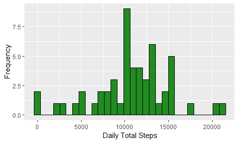
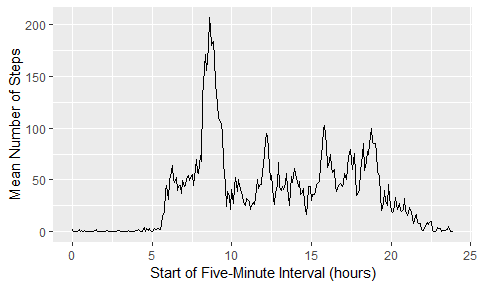
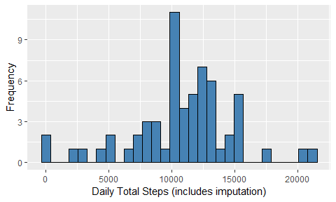
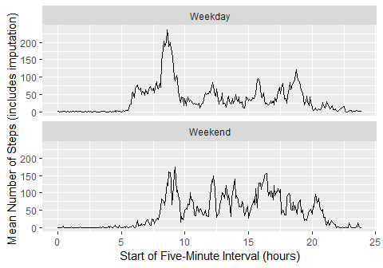

* * *

## Setup

<br>


```r
## Set all chunks to show code. Manually set figures path.
knitr::opts_chunk$set(echo = TRUE, 
                      fig.path = "./figures/")

## Load relevant packages.
library(readr)
library(dplyr)
library(stringr)
library(lubridate)
library(ggplot2)
```

* * *

## Loading and preprocessing the data

<br>

#### Item 1. Load the data.

We begin with a code chunk for downloading the provided data file and unzipping it. We include it for completeness. Per the project instructions, we can assume that the data file has already been appropriately downloaded and extracted to the same directory as this `.Rmd` file. As such, we'll set the chunk option `eval = FALSE` for this chunk so that it isn't evaluated upon knitting.


```r
download.file(url = "https://d396qusza40orc.cloudfront.net/repdata%2Fdata%2Factivity.zip", 
              destfile = "./activity.zip", 
              method = "curl")
unzip(zipfile = "./activity.zip", 
      exdir = "./")
```

Now we'll read the data in. Just to try something new, we made use of the function `read_csv()` from the package `readr`. We specify to read the second and third columns of the data, `date` and `interval`, as character strings for easier processing in the next code chunk.


```r
activity <- read_csv(file = "../data/activity.csv", 
                     col_types = "icc", 
                     n_max = 17659)
```

<br>

#### Item 2. Process/transform the data (if necessary) into a format suitable for your analysis.

Upon examining the `interval` column of the data, we note that times are not expressed with leading zeros when needed (i.e. the time `0005`, which corresponds to `00:05` or `12:05 AM` depending on locale, is stored as `5`). So before we continue, we'll use `str_pad()` from the package `stringr` to add leading zeros as needed to the `interval` variable so that it is handled correctly when we convert these character strings to date/time objects.


```r
activity <- activity %>% 
    mutate(interval = str_pad(interval, 4, "left", "0"))
```

Now, the `date` and `interval` variables comprise a valid date and time. So, we `paste()` these variables together, then use the `lubridate` package to convert them from character strings to `POSIXct` date/time objects. We take these dates and times to be the *beginning* of each five-minute interval for which we have counts of steps. To help our conceptual understanding of the data, we'll also add a second date/time column that represents the *end* of each five-minute interval. Finally, we'll remove the `date` and `interval` columns since they're no longer necessary.


```r
activity <- activity %>% 
    mutate(int_start = ymd_hm(paste(date, interval)), 
           int_end = int_start + dminutes(5)) %>% 
    select(-date, -interval)
```

As our final processing task, we'll use some various `lubridate` functions to extract items of interest from the new date/time objects. These will help for later tasks and give us additional variables by which we can filter or group as necessary.


```r
activity <- activity %>% 
    mutate(date = date(int_start), 
           year = year(int_start), 
           month = month(int_start), 
           day_of_month = mday(int_start), 
           day_of_week = wday(int_start, label = TRUE), 
           hour = hour(int_start), 
           minute = minute(int_start))
```

* * *

## What is the mean total number of steps taken per day?

For this part of the assignment, we ignore missing values.

<br>

#### Item 1. Calculate the total number of steps taken per day.

Since we can ignore missing values for now, we'll begin by constructing a reduced data set that has missing values removed.


```r
activity_narm <- activity %>% 
    filter(!is.na(steps))
```

Next, we'll create a summary data frame whose purpose is to find the sum of the number of steps taken on each day. Since the resulting table has 53 rows, we'll just print out a few of them to demonstrate the result.


```r
activity_daily_steps <- activity_narm %>% 
    group_by(date) %>% 
    summarize(daily_total = sum(steps))
knitr::kable(head(activity_daily_steps))
```


date          daily_total
-----------  ------------
2012-10-02            126
2012-10-03          11352
2012-10-04          12116
2012-10-05          13294
2012-10-06          15420
2012-10-07          11015

From this table, we can see that the first day, 2012-10-02, has an unusually low number of steps, 126. But then the next few days in the table appear to have more consistent numbers of steps.

<br>

#### Item 2. Make a histogram of the total number of steps taken each day.

We'll use `ggplot2` to construct a histogram of these daily step counts.


```r
ggplot(data = activity_daily_steps) + 
    geom_histogram(mapping = aes(x = daily_total), bins = 30, 
                   color = "black", fill = "forestgreen") + 
    labs(x = "Daily Total Steps", y = "Frequency")
```

<!-- -->

The histogram shows a few values near zero, and there are several values scattered between about 2000 and 10000. There is a spike of values around 10000, and the majority of step counts fall between 10000 and about 16000. Two values appear that are greater than 20000.

<br>

#### Item 3. Calculate and report the mean and median of the total number of steps taken per day.

For calculating the mean and median, we'll make use of `summary()` in the package `dplyr`.


```r
daily_steps_summary <- activity_daily_steps %>% 
    summarize(mean_daily_total = mean(daily_total), 
              median_daily_total = median(daily_total))
knitr::kable(daily_steps_summary)
```


 mean_daily_total   median_daily_total
-----------------  -------------------
         10766.19                10765

From this table, we see that the mean of the daily step totals is 10766.19 and the median of the daily step totals is 10765. It's noteworthy that the mean and median values are so close to each other.

* * *

## What is the average daily activity pattern?

For this part of the assignment, we ignore missing values.

<br>

#### Item 1. Make a time series plot of the 5-minute interval (x-axis) and the average number of steps taken, averaged across all days (y-axis).

Before we get to the plot, we'll create another summary data frame in which we calculate the mean number of steps recorded for each five-minute interval in the data.


```r
activity_mean_steps_interval <- activity_narm %>% 
    group_by(hour, minute) %>% 
    summarize(mean_steps_interval = mean(steps))
```

Now we'll make our time series plot. To avoid the horizontal axis being considered character strings, we'll compute the intervals as a number of hours from the start of the day (i.e. the time `12:30` would be calculated as `12.5`).


```r
ggplot(data = activity_mean_steps_interval) + 
    geom_line(mapping = aes(x = hour + (minute / 60), 
                            y = mean_steps_interval)) + 
    labs(x = "Start of Five-Minute Interval (hours)", 
         y = "Mean Number of Steps")
```

<!-- -->

In this plot, we see that the largest peak in the mean number of steps occurs around 8:30. There are a few smaller peaks at other times in the day, such as around 12:30, around 16:00, and around 18:30.

<br>

#### Item 2. Which 5-minute interval, on average across all the days in the data set, contains the maximum number of steps?

For this question, we'll again use `dplyr` functions. This time we'll `arrange()` the data according to the mean number of steps, then convert the times to be more human-readable by placing the `hour` and `minute` values inside a character string.


```r
mean_steps_by_interval <- activity_mean_steps_interval %>% 
    ungroup() %>% 
    arrange(desc(mean_steps_interval)) %>% 
    transmute(time = str_c(hour, ":", str_pad(minute, 2, "left", "0")), 
              mean_steps_interval)
knitr::kable(head(mean_steps_by_interval, 1))
```


time    mean_steps_interval
-----  --------------------
8:35               206.1698

This table tells us that the five-minute interval with the greatest mean number of steps is the interval starting at 8:35, with a mean number of steps of approximately 206.17.

* * *

## Imputing missing values

For this part of the assignment, we directly address missing values.

<br>

#### Item 1. Calculate and report the total number of missing values in the data set.

To count the number of missing values, we'll `filter()` according to missing values, then count the rows in the result with `nrow()`.


```r
num_missing <- activity %>% 
    filter(is.na(steps)) %>% 
    nrow()
num_missing
```

```
## [1] 2304
```

This result tells us that there are 2304 missing values in the data.

<br>

#### Item 2. Devise a strategy for filling in all of the missing values in the dataset.

For our imputation strategy, we'll make use of two primary pieces of information. For each missing value, we'll consider (1) the five-minute interval, and (2) the day of the week. Our reasoning is that a given person's activity (step count) is likely to vary between days of the week, but it seems likely that on average, that person's activity will be similar on the same day of the week (i.e. the person's activity on a Monday should roughly resemble that same person's activity on another Monday). Further, within two of the same day of the week, a person's activity during a given five-minute interval is likely to resemble that same person's activity during that same five-minute interval on the same day of the week.

For each missing value, we'll calculate the average of non-missing values in the same day of the week *and* the same five-minute interval. This calculated average will replace the missing value. Our hope is that this will replace missing data with a calculation that should at least be close to representative of the number of steps this person actually took during that time.

<br>

#### Item 3. Create a new dataset that is equal to the original dataset but with the missing data filled in.

To create the new dataset, we'll calculate the mean of all non-missing values for each five-minute interval and each day of the week. Then we'll create a new column to which we assign either the number of steps in the original data (if that value is not missing) or the calculated mean of non-missing values (if the value in question is missing).


```r
activity_imputed <- activity %>% 
    group_by(day_of_week, hour, minute) %>% 
    mutate(mean_narm = mean(steps, na.rm = TRUE), 
           imputed_steps = ifelse(is.na(steps), mean_narm, steps)) %>% 
    ungroup()
```

<br>

#### Item 4. Make a histogram of the total number of steps taken each day and calculate and report the mean and median total number of steps taken per day. Do the values differ from the estimates from the first part of the assignment? What is the impact of imputing missing data on the estiamtes of the total daily number of steps?

To create our histogram, we'll follow a similar procedure to that which we followed in creating our earlier histogram. This time, using the new dataset, we'll calculate the sum of the step counts for each day in the data, and we'll pass the resulting data frame to `ggplot()` for creating the histogram.


```r
activity_imputed_daily <- activity_imputed %>% 
    group_by(date) %>% 
    summarize(daily_total = sum(imputed_steps))
ggplot(data = activity_imputed_daily) + 
    geom_histogram(mapping = aes(x = daily_total), bins = 30, 
                   color = "black", fill = "steelblue") + 
    labs(x = "Daily Total Steps (includes imputation)", y = "Frequency")
```

<!-- -->

The imputation of missing values has not had a major effect on the structure of the histogram. As before, we see some values below 10000, then a spike of values at 10000, and the majority of the values lie between 10000 and 16000.

Now we'll calculate the mean and median of the new dataset for comparison to the original dataset.


```r
imputed_daily_steps_summary <- activity_imputed_daily %>% 
    summarize(mean_daily_total = mean(daily_total), 
              median_daily_total = median(daily_total))
knitr::kable(imputed_daily_steps_summary)
```


 mean_daily_total   median_daily_total
-----------------  -------------------
         10821.21                11015

We do see some movement in the mean and median of the daily step counts after imputing the missing values. The mean number of steps per day has increased to 10821.21 while the median number of steps per day has increased to 11015. Also of interest is that the difference between the mean and median increased, which suggests that the distribution of the daily step totals is slightly more skewed in the dataset with missing step counts imputed than in the original data set.

* * *

## Are there differences in activity patterns between weekdays and weekends?

For this part of the assignment, we use imputed values in place of missing values.

<br>

#### Item 1. Create a new factor variable in the dataset with two levels--"Weekday" and "weekend"--indicating whether a given date is a weekday or a weekend day.

To create our new variable, we'll make use of the `day_of_week` variable that we already created during the data processing stage. We'll check its value and assign the new variable values of `"Weekday"` or `"Weekend"` accordingly.


```r
activity_imputed <- activity_imputed %>% 
    mutate(day_type = factor(ifelse(day_of_week %in% c("Sat", "Sun"), 
                                    "Weekend", "Weekday")))
```

<br>

#### Item 2. Make a panel plot containing a time series plot of the 5-minute interval (x-axis) and the average number of steps taken, averaged across all weekday days or weekend days (y-axis).

As before, we'll first create a summary data frame to be used in our time series plot. This will calculate the mean number of steps in the new dataset for each five-minute interval and each type of day. To create our time series plot, our basic plot will have a similar structure to the one we created earlier, where we converted times to be expressed as numbers of hours from the beginning of the day. To create this panel plot, we'll use `facet_wrap()` from `ggplot2` and specify to place the panels in one column, as was shown in the example figure.


```r
activity_imputed_weekday <- activity_imputed %>% 
    group_by(day_type, hour, minute) %>% 
    summarize(mean_imputed_steps = mean(imputed_steps))
ggplot(data = activity_imputed_weekday) + 
    geom_line(mapping = aes(x = hour + minute / 60, y = mean_imputed_steps)) + 
    facet_wrap(facets = vars(day_type), ncol = 1) + 
    labs(x = "Start of Five-Minute Interval (hours)", 
         y = "Mean Number of Steps (includes imputation)")
```

<!-- -->

There are some interesting features shown in this plot. Both plots have peaks around 8:30, though the weekday plot's peak is much higher. Further, this 8:30 peak is significantly higher than any other peaks in the weekday plot, while the 8:30 peak in the weekend plot is roughly similar in height to a peak at around 9:00, a peak near 12:00, and a peak near 16:30. These plots would seem to demonstrate the pattern of someone that works in an office during regular weekdays: the morning pattern might be the commute, or just arriving and settling in at work, while the relatively low step counts otherwise represent being more stationary while working. The weekend plot is less concentrated, and shows more activity at different times during the day.
